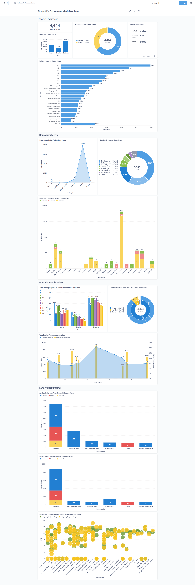
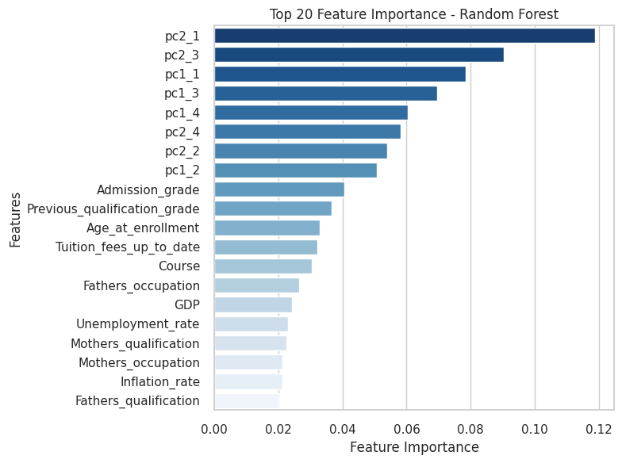
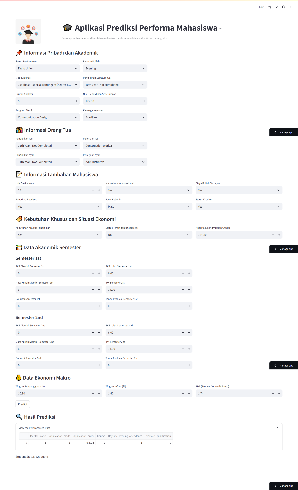

# **Proyek Pertama: Menyelesaikan Permasalahan Institusi Pendidikan**

## **Business Understanding**

### **Latar Belakang Bisnis**

Jaya Jaya Institut merupakan sebuah institusi pendidikan tinggi yang telah beroperasi sejak tahun 2000 dan dikenal luas karena keberhasilannya dalam menghasilkan lulusan yang kompeten. Meskipun demikian, institusi ini menghadapi tantangan serius berupa tingginya angka siswa yang tidak menyelesaikan studinya atau mengalami putus kuliah (dropout). Tingginya tingkat dropout ini menjadi isu penting karena dapat memengaruhi reputasi lembaga, efektivitas pengelolaan akademik, serta keberhasilan studi para mahasiswa. Menyadari dampak tersebut, Jaya Jaya Institut berkomitmen untuk mencari solusi yang bersifat preventif. Salah satu langkah strategis yang diambil adalah dengan menerapkan pendekatan data science guna mengidentifikasi secara dini siswa yang memiliki risiko tinggi untuk dropout. Dengan deteksi dini ini, diharapkan pihak institusi dapat memberikan intervensi atau bimbingan khusus agar siswa dapat melanjutkan dan menyelesaikan pendidikannya dengan baik.

### **Permasalahan Bisnis**

Masalah utama yang dihadapi oleh Jaya Jaya Institut adalah tingginya tingkat siswa yang tidak menyelesaikan pendidikan atau dropout. Beberapa permasalahan yang melatarbelakangi proyek ini antara lain:
1. Tingginya angka dropout: Banyak mahasiswa yang tidak menyelesaikan studinya, sehingga berdampak negatif pada reputasi institusi dan efektivitas proses pendidikan.
2. Kurangnya deteksi dini terhadap siswa berisiko dropout: Belum ada sistem prediktif yang dapat mengidentifikasi mahasiswa yang berpotensi keluar lebih awal.
3. Dampak terhadap kualitas dan efisiensi operasional: Dropout menyebabkan hilangnya potensi lulusan berkualitas dan menambah beban administratif serta biaya operasional.
4. Kebutuhan akan solusi berbasis data science: Institusi membutuhkan pendekatan berbasis data untuk mengidentifikasi faktor-faktor risiko dan memberikan bimbingan secara tepat sasaran.

### **Cakupan Proyek**

Proyek ini mencakup:
1. Eksplorasi dan Pembersihan Data
    - Menggunakan dataset `data.csv` yang berisi informasi jalur akademik, data demografi, faktor sosial ekonomi, serta performa akademik semester awal mahasiswa.
    - Melakukan pengecekan missing values, duplikasi, dan konsistensi data.
    - Mengubah tipe data yang sesuai (misalnya pada kolom kategori), serta encoding pada variabel kategorikal.
2. Analisis Eksploratori (Exploratory Data Analysis / EDA)
    - Visualisasi distribusi data seperti gender, usia, latar belakang pendidikan, dan lain-lain.
    - Analisis hubungan antara berbagai fitur dengan status kelulusan/dropout mahasiswa.
3. Pemodelan Prediktif
    - Menggunakan algoritma klasifikasi seperti Random Forest, Naive Bayes, dan XGBoost.
    - Optimasi hyperparameter menggunakan Bayesian Optimization.
    - Evaluasi model menggunakan metrik seperti akurasi, presisi, recall, dan F1-score.
4. Visualisasi dan Interpretasi Feature Importance
    - Mengidentifikasi fitur-fitur yang paling berpengaruh terhadap potensi dropout.
    - Menyediakan dasar untuk intervensi kebijakan atau bimbingan mahasiswa.
5. Penyimpanan dan Deploy Model
    - Model dan hasil analisis disimpan dalam format .joblib dan .csv.
    - Konektivitas ke dashboard (seperti Metabase) dan database (PostgreSQL) untuk visualisasi manajemen.
    - Implementasi model prediksi ke platform streamlit
6. Penyusunan Insight dan Rekomendasi
    - Memberikan insight berdasarkan hasil analisis

### **Persiapan**

**Sumber Data:** 

Dataset yang digunakan dalam proyek ini adalah Dataset [Siswa Jaya Jaya Institusi](https://github.com/dicodingacademy/dicoding_dataset/blob/main/students_performance/data.csv) sesuai dengan instruksi dari submission proyek ini.

**Setup Environtment:**

Proyek ini memerlukan lingkungan kerja yang sederhana untuk melakukan analisis data serta membangun dashboard. Berikut ini merupakan tahapan-tahapan dalam menyiapkan environment tersebut:
1. Setup `notebook.ipynb`
- Download proyek ini terlebih dahulu.
- Pastikan dependensi, packages, library yang dibutuhkan sudah tersedia (lihat file requirements.txt untuk melihat dependensi yang dibutuhkan).
- Buka menggunakan VSCode Jupyter Notebook atau Google Colaboratory.
    * Menggunakan Jupyter Notebook 
        - Buka Terminal
        - Arahkan ke direktori tempat file proyek disimpan.
        - Contoh: `cd D:this/file/to/your/path`
        - Jalankan perintah `jupyter lab .` / `jupyter notebook`
    * Menggunakan Google Colaboratory
        - Buka Notebook baru
        - Upload dan pilih file ini (notebook.ipynb)
        - Sambungkan ke runtime yang disediakan Google.
        - Kemudian jalankan seluruh sel kode.
2. Setup Dashboard
- Gunakan metabase dengan docker
    - Buka terminal/wsl
    - Jalankan perintah berikut:
    ```
    docker pull metabase/metabase:v0.46.4
    ```
    - Jalankan container metabase:
    ```
    docker run -p 3000:3000 --name metabase_studentperformance metabase/metabase
    ```
    - Login ke metabase dengan username dan password:
    ```
    username: root@mail.com
    password: root123
    ```

## **Business Dashboard**

📊 Hasil Analisis dan Model Prediktif dalam Dashboard Mahasiswa

Dashboard ini menyajikan hasil analisis data performa mahasiswa dan model prediktif dalam bentuk visual interaktif menggunakan Metabase. Tujuannya adalah untuk membantu pihak manajemen dan akademik di Jaya Jaya Institut dalam memantau, memahami, serta mengambil tindakan berdasarkan data yang aktual. Berikut adalah elemen-elemen utama dalam dashboard:
1. Ringkasan Statistik (Overview)

    Memberikan gambaran umum tentang kondisi mahasiswa saat ini:
    - Jumlah Mahasiswa: Total 4.424 mahasiswa terdaftar.
    - Distribusi Status Mahasiswa: Termasuk kategori Dropout, Enrolled, dan Graduate.    
    - Rasio Gender Mahasiswa: 65% perempuan, 35% laki-laki.
    - Rincian Status Mahasiswa: Terdapat 2.209 mahasiswa yang telah lulus (49,93%).

2. Analisis Demografis Mahasiswa

    Menampilkan karakteristik umum mahasiswa:
    - Distribusi Mode Aplikasi Mahasiswa: Informasi jalur masuk seperti 1st phase, Direct, dsb.
    - Distribusi Negara Asal Mahasiswa: Menunjukkan banyaknya mahasiswa dari berbagai negara dengan status kelulusan masing-masing.

3. Data Ekonomi Makro

    Menganalisis hubungan antara kondisi sosial-ekonomi dengan performa studi:
    - Tingkat Pengangguran (%) dan Keberlanjutan Studi Mahasiswa: Menghubungkan rasio pengangguran di daerah asal dengan status mahasiswa.
    - Distribusi Status Pernikahan dan Status Pendidikan: Memetakan pengaruh status keluarga terhadap performa mahasiswa.

4. Analisis Latar Belakang Keluarga

    Membahas dampak latar belakang keluarga terhadap keberhasilan akademik:
    - Pekerjaan Ayah & Ibu terhadap Status Mahasiswa: Misalnya, pekerjaan seperti wiraswasta atau buruh berasosiasi dengan tingkat dropout yang lebih tinggi.
    - Latar Belakang Pendidikan Ibu vs Nilai Mahasiswa: Menunjukkan pola bahwa semakin tinggi pendidikan ibu, semakin baik performa akademik mahasiswa.



### **Cara Mengakses Dashboard**

1. Buka Docker Desktop yang telah disiapkan pada tahap Setup Environment.
2. Jalankan dan buka container yang terdapat di dalam Docker.
3. Salin link port localhost dari container dengan nama `metabase_studentperformance`.
4. Buka aplikasi Metabase melalui browser menggunakan link tersebut.
5. Masukkan username dan password untuk login ke Metabase.
    ```
    username: root@mail.com 
    password: root123
    ```

## **Conclusion**

🎯 **Tujuan Proyek Ini**:
- Menganalisis performa akademik siswa dari berbagai latar belakang menggunakan data dari [Realinho,Valentim, Vieira Martins,Mónica, Machado,Jorge, and Baptista,Luís. (2021). Predict students' dropout and academic success. UCI Machine Learning Repository.](https://doi.org/10.24432/C5MC89)
- Mengidentifikasi faktor-faktor utama yang mempengaruhi kelulusan siswa.
- Mengembangkan model prediksi kelulusan siswa berdasarkan karakteristik individu dan latar belakang mereka.
- Menyajikan hasil analisis dan prediksi dalam bentuk dashboard interaktif untuk mendukung pengambilan keputusan di Jaya Jaya Institut.

📊 **Evaluasi dan Perbandingan Akhir antar Model**

Evaluasi performa model dilakukan untuk menentukan algoritma mana yang paling baik dalam memprediksi kelulusan siswa berdasarkan data yang tersedia. Empat algoritma machine learning telah diuji: Decision Tree, Random Forest, Naive Bayes, dan XGBoost, dengan hasil sebagai berikut:

<table border="1" cellpadding="6" cellspacing="0">
  <thead>
    <tr>
      <th>Model</th>
      <th>Accuracy</th>
      <th>Precision</th>
      <th>Recall</th>
      <th>F1 Score</th>
    </tr>
  </thead>
  <tbody>
    <tr>
      <td>Decision Tree (Tuned)</td>
      <td>0.657658</td>
      <td>0.579422</td>
      <td>0.577822</td>
      <td>0.576053</td>
    </tr>
    <tr>
      <td>Random Forest (Tuned)</td>
      <td>0.752252</td>
      <td>0.707886</td>
      <td>0.676367</td>
      <td>0.686002</td>
    </tr>
    <tr>
      <td>Naive Bayes (Tuned)</td>
      <td>0.68018</td>
      <td>0.639582</td>
      <td>0.637125</td>
      <td>0.638098</td>
    </tr>
    <tr>
      <td>XGBoost (Tuned)</td>
      <td>0.711712</td>
      <td>0.670106</td>
      <td>0.64418</td>
      <td>0.652681</td>
    </tr>
  </tbody>
</table>

🧾 **Kesimpulan Model**
- Random Forest merupakan model terbaik di antara keempat model yang diuji. Model ini memiliki nilai:
    - Akurasi tertinggi (75.23%)
    - Precision dan Recall yang seimbang dan tinggi, menghasilkan F1 Score tertinggi (0.6860)
- XGBoost menunjukkan performa yang kompetitif, berada di posisi kedua.
- Naive Bayes memiliki performa cukup baik, namun kalah dari Random Forest dan XGBoost dalam seluruh metrik.
- Decision Tree memiliki performa paling rendah, menunjukkan bahwa model ini cenderung overfitting atau kurang mampu menangkap pola kompleks dalam data.
- Random Forest Classifier sebagai model utama dalam sistem prediksi kelulusan karena memberikan keseimbangan terbaik antara akurasi, ketepatan, dan sensitivitas prediksi.

🔍 **Kesimpulan Utama Analisis**
1. Model terbaik yang digunakan adalah Random Forest Classifier.
2. Berdasarkan dashboard yang telah dibuat, didapatkan kesimpulan utama analisis, yaitu:
    - Jumlah Siswa Lulus: Sekitar 49.93% siswa telah menyelesaikan studi (2.209 dari 4.424 siswa).
    - Faktor Utama Kelulusan:
        - Faktor seperti score akademik (pc-1, pc-2, dsb), aspek demografi, dan status pernikahan memiliki pengaruh signifikan.
    - Distribusi Gender: Proporsi siswa perempuan lebih tinggi daripada laki-laki.
    - Kebanyakan Siswa berasal dari satu negara dominan, menandakan potensi fokus lokal pada kebijakan pendidikan.
    - Latar Belakang Orang Tua dan pekerjaan turut memengaruhi performa akademik siswa.
    - Tingkat Perguruan Ibu & Ayah berkolerasi positif dengan performa siswa, khususnya pada skor dan tingkat kelulusan.
3. 📊 Analisis Feature Importance – Random Forest

Visualisasi ini menunjukkan fitur-fitur paling berpengaruh dalam menentukan apakah seorang mahasiswa akan lulus atau tidak, berdasarkan hasil training model Random Forest.

🔝 Fitur PCA
<table border="1" cellpadding="8" cellspacing="0">
  <thead>
    <tr>
      <th>Fitur PCA</th>
      <th>Asal Data</th>
      <th>Penjelasan</th>
    </tr>
  </thead>
  <tbody>
    <tr>
      <td>pc2_1, pc2_3, pc2_4, pc2_2</td>
      <td>Semester 2</td>
      <td>Merangkum kombinasi variabel seperti jumlah mata kuliah yang diambil, nilai, jumlah yang lulus, dan evaluasi di semester 2.</td>
    </tr>
    <tr>
      <td>pc1_1, pc1_3, pc1_4, pc1_2</td>
      <td>Semester 1</td>
      <td>Sama seperti semester 2, tetapi berdasarkan performa di semester 1.</td>
    </tr>
  </tbody>
</table>

🎓 Fitur Non-PCA yang Relevan
<table border="1" cellpadding="8" cellspacing="0">
  <thead>
    <tr>
      <th>Fitur</th>
      <th>Penjelasan</th>
    </tr>
  </thead>
  <tbody>
    <tr>
      <td>Admission_grade</td>
      <td>Nilai saat masuk menunjukkan kesiapan awal mahasiswa dan sangat memengaruhi performa selanjutnya.</td>
    </tr>
    <tr>
      <td>Previous_qualification_grade</td>
      <td>Nilai dari pendidikan sebelumnya juga berperan dalam keberhasilan akademik di jenjang baru.</td>
    </tr>
    <tr>
      <td>Age_at_enrollment</td>
      <td>Usia saat masuk kuliah berpotensi terkait kedewasaan atau kesiapan belajar.</td>
    </tr>
    <tr>
      <td>Tuition_fees_up_to_date</td>
      <td>Mahasiswa yang membayar tepat waktu cenderung lebih stabil dan fokus.</td>
    </tr>
    <tr>
      <td>Course</td>
      <td>Jurusan tertentu bisa memiliki tingkat kelulusan yang lebih tinggi atau rendah.</td>
    </tr>
    <tr>
      <td>Fathers_occupation, Mothers_occupation, Mothers_qualification</td>
      <td>Latar belakang keluarga turut memengaruhi support sistem mahasiswa.</td>
    </tr>
  </tbody>
</table>

🧠 Kesimpulan Utama
- Faktor akademik adalah determinan utama keberhasilan kelulusan.
- PCA berhasil merangkum kompleksitas dari performa akademik dan memunculkan komponennya sebagai fitur paling penting.
- Faktor sosio-demografis seperti latar belakang keluarga, usia, dan kedisiplinan finansial mahasiswa tetap relevan namun memiliki pengaruh lebih kecil dibandingkan performa akademik.



3. Notebook juga mempersiapkan dashboard dan koneksi ke database (menggunakan SQLAlchemy dan Supabase) untuk keperluan business monitoring lebih lanjut.

**🤖 Implementasi Prediksi Model**

[Prototype Model dengan Streamlit Community Cloud](https://studentperfomanceanalysisgit-3jv6owomqm6yssbm7sz38b.streamlit.app/)



## **Rekomendasi Action Items untuk Jaya jaya Institut**

🎯 Rekomendasi Action Items untuk Jaya Jaya Institut
1. Fokus Intervensi pada Mahasiswa dengan Risiko Tinggi
    - Buat sistem peringatan dini untuk mahasiswa dengan nilai akademik rendah, tingkat absen tinggi, atau latar belakang keluarga rentan.
2. Program Bimbingan Akademik dan Mentoring
    - Terapkan program bimbingan akademik atau mentoring sejak semester pertama, terutama bagi mahasiswa dari kategori risiko tinggi.
3. Peningkatan Keterlibatan Orang Tua/Wali
    - Libatkan orang tua/wali dalam proses pendidikan melalui seminar daring/bimbingan berkala, agar mereka sadar akan kondisi dan kebutuhan anaknya.
4. Perluasan Dukungan Finansial dan Beasiswa
    - Tingkatkan akses terhadap beasiswa berbasis kebutuhan ekonomi dan buat program subsidi pendidikan tambahan (misalnya, transportasi atau buku).
5. Pemantauan dan Evaluasi Dashboard Berbasis Data
    - Gunakan dashboard ini secara aktif oleh tim akademik, bimbingan konseling, dan manajemen untuk mendeteksi tren negatif dan merespons cepat.
6. Peningkatan Soft Skill & Kesejahteraan Mental
    - Sediakan layanan konseling psikologis dan pelatihan soft skill (manajemen waktu, belajar efektif, dll).
7. Kerja Sama dengan Dunia Industri dan Pemerintah
    - Bangun kerja sama magang dan pendampingan karier dengan dunia industri agar mahasiswa memiliki visi masa depan yang lebih kuat.

## 📄 **Executive Summary**

Jaya Jaya Institut menghadapi tantangan dalam memahami faktor-faktor yang memengaruhi kelulusan siswa dan dalam mengoptimalkan strategi pembelajaran berbasis data. Untuk menjawab tantangan ini, dilakukan proyek analisis data akademik dengan tujuan mengidentifikasi variabel-variabel utama yang berdampak terhadap kelulusan serta membangun sistem prediksi dan dashboard untuk membantu pengambilan keputusan.

Proyek ini menggunakan pendekatan data science berbasis Python dengan data historis siswa dari platform Dicoding. Langkah-langkah yang dilakukan meliputi eksplorasi data, analisis visualisasi interaktif, pembuatan model prediktif kelulusan, dan evaluasi performa model. Model terbaik yang diperoleh adalah Random Forest Classifier, yang menunjukkan performa akurasi dan F1 score tertinggi dibanding model lain setelah proses tuning.

Faktor-faktor utama yang memengaruhi kelulusan siswa diidentifikasi sebagai berikut:

Sebagai hasil akhir, data yang telah melalui proses cleaning dan transformasi disimpan dalam `cleaned_dataset.csv`. Sistem juga telah dilengkapi dengan dashboard interaktif yang memungkinkan manajemen institusi untuk memantau distribusi kelulusan, menganalisis profil siswa, dan memetakan faktor risiko akademik secara berkelanjutan.

Dashboard dan model prediktif ini dapat digunakan untuk memberikan intervensi tepat sasaran bagi siswa yang berisiko tidak lulus, serta sebagai landasan strategi peningkatan kualitas pendidikan di Jaya Jaya Institut.
